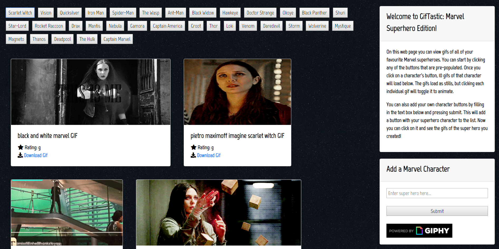

<h1>GifTastic: Marvel Superhero Edition</h1>
<h3>Marvel superhero themed gif application created with JavaScript, jQuery, HTML and CSS</h3>

<ul>
<li><a href="https://adam28p.github.io/GifTastic/" target="_blank">Live Demo</a></li>
</ul>

<h2>Screenshot</h2>

<h2>Web Application Logic</h2>
<ul>

When this web page loads you can view gifs of all of your favourite Marvel superheroes. You can start by clicking any of the buttons that are pre-populated. Once you click on a character's button, 10 gifs of that character will load below. The gifs load as stills, but clicking each individual gif will toggle it to animate. 

You can also add your own character buttons by filling in the text box below and pressing submit. This will add a button with your superhero character to the list. Now you can click on it and see the gifs of the super hero you created! 

The newly created buttons will remain on the screen as they are saved to your local storage.

You can also load an additional 10 gifs by clicking on the button below all of the gifs.

Have fun! 

</ul>